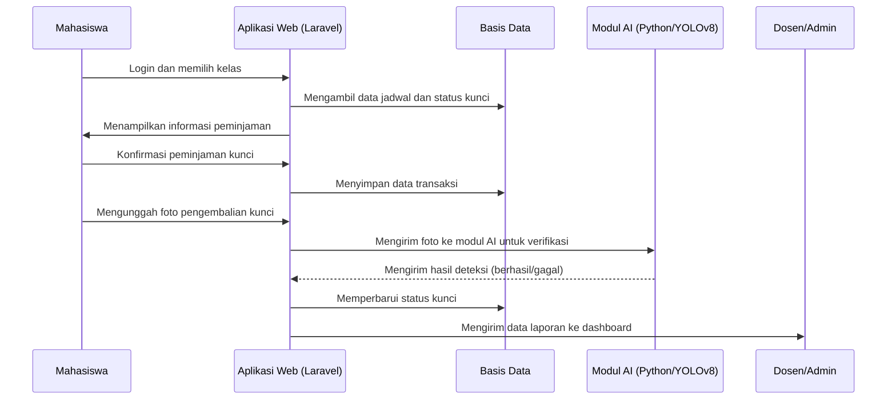

# Web KunciKu

## 01 - Dokumen Gambaran Umum Proyek (Project Overview)

---

## 1. Pendahuluan

### 1.1 Latar Umum

Web KunciKu merupakan aplikasi berbasis web yang dirancang untuk mempermudah proses peminjaman dan pengembalian kunci ruang kelas serta perangkat proyektor di lingkungan kampus.
Sistem ini menggantikan proses manual yang selama ini dilakukan dengan pencatatan di buku menjadi sistem digital yang terintegrasi, efisien, dan dapat dipantau secara real-time.

Aplikasi ini juga dilengkapi dengan fitur tambahan berupa **pengenalan gambar (image recognition)** menggunakan **model YOLOv8** yang dijalankan pada **Python 3.13**.
Fitur ini berfungsi untuk memverifikasi secara otomatis apakah kunci benar-benar telah dikembalikan ke posisi semula pada papan kunci.
Dengan demikian, sistem ini diharapkan mampu mengurangi kecurangan dan kehilangan kunci yang sering terjadi dalam sistem manual.

---

## 2. Latar Belakang

Proses peminjaman kunci di kampus selama ini dilakukan secara manual dengan menulis nama, kelas, nama dosen, dan tanda tangan di buku peminjaman.
Namun, pendekatan ini memiliki beberapa permasalahan utama, antara lain:

1. Sulit untuk mengetahui siapa yang terakhir meminjam kunci tertentu.
2. Data dapat hilang atau rusak karena media pencatatannya berbentuk fisik (buku).
3. Tidak ada verifikasi yang memastikan bahwa kunci benar-benar dikembalikan ke tempatnya.
4. Dosen piket kesulitan dalam membuat laporan atau rekapitulasi harian/mingguan.

Untuk mengatasi hal tersebut, **Web KunciKu** dikembangkan sebagai sistem berbasis web yang mampu mendigitalisasi proses administrasi peminjaman dan pengembalian kunci secara menyeluruh.

---

## 3. Tujuan Proyek

Tujuan utama dari pembangunan sistem Web KunciKu adalah sebagai berikut:

1. Mentransformasikan sistem pencatatan manual menjadi sistem digital berbasis web.
2. Menyediakan pencatatan waktu peminjaman dan pengembalian secara otomatis.
3. Menambahkan mekanisme verifikasi pengembalian berbasis pengenalan gambar.
4. Mempermudah proses pelaporan dan audit data peminjaman bagi dosen atau petugas.
5. Meningkatkan transparansi, akurasi data, dan akuntabilitas dalam proses peminjaman kunci.

---

## 4. Ruang Lingkup Sistem

Sistem Web KunciKu memiliki ruang lingkup berikut:

1. Sistem dapat digunakan oleh dua peran utama yaitu **mahasiswa** dan **dosen**.
2. Mahasiswa dapat melakukan login, memilih kelas, dan meminjam kunci ruangan sesuai jadwal yang berlaku.
3. Mahasiswa dapat mengembalikan kunci dengan mengunggah foto bukti pengembalian.
4. Sistem dapat melakukan verifikasi otomatis menggunakan model AI (YOLOv8).
5. Sistem mencatat kondisi proyektor dan peralatan lain yang digunakan dalam ruangan.
6. Sistem memungkinkan pengguna mengunggah bukti kebersihan ruang laboratorium atau kelas setelah penggunaan.
7. Sistem mencatat waktu peminjaman dan pengembalian untuk mendeteksi keterlambatan.
8. Sistem menyediakan halaman laporan dan dashboard bagi dosen atau admin untuk memantau status peminjaman dan pengembalian.

---

## 5. Manfaat Sistem

Manfaat dari penerapan sistem Web KunciKu meliputi:

1. **Efisiensi waktu:** proses peminjaman dan pengembalian lebih cepat tanpa harus mencatat manual.
2. **Peningkatan akurasi data:** seluruh aktivitas tercatat otomatis dalam basis data.
3. **Transparansi dan akuntabilitas:** mudah melacak siapa peminjam dan kapan kunci dikembalikan.
4. **Keamanan data:** mengurangi risiko kehilangan atau manipulasi data.
5. **Kemudahan pelaporan:** rekap aktivitas dapat dilihat kapan saja oleh dosen atau pengelola.

---

## 6. Ringkasan Fitur

| No  | Fitur                        | Deskripsi                                                                     |
| --- | ---------------------------- | ----------------------------------------------------------------------------- |
| 1   | Autentikasi Pengguna         | Login berbasis peran (mahasiswa dan dosen)                                    |
| 2   | Peminjaman Berdasarkan Kelas | Sistem otomatis menyesuaikan kunci berdasarkan kelas yang dipilih             |
| 3   | Pencatatan Otomatis          | Sistem mencatat waktu peminjaman dan pengembalian secara otomatis             |
| 4   | Verifikasi Gambar            | Menggunakan YOLOv8 untuk memastikan kunci telah dikembalikan ke tempat semula |
| 5   | Status Peralatan             | Mencatat kondisi proyektor atau alat lain dalam ruangan                       |
| 6   | Pelaporan Kebersihan         | Pengguna dapat mengunggah foto kebersihan ruang atau laboratorium             |
| 7   | Deteksi Keterlambatan        | Sistem menandai jika kunci dikembalikan melebihi waktu yang ditentukan        |
| 8   | Dashboard Laporan            | Admin dapat memantau aktivitas peminjaman dan kondisi alat secara keseluruhan |

---

## 7. Arsitektur Sistem

### 7.1 Deskripsi Arsitektur

Arsitektur Web KunciKu dirancang dalam tiga lapisan utama:

1. **Lapisan Aplikasi Web (Laravel 12):**
   Menangani autentikasi pengguna, pengelolaan data, logika peminjaman dan pengembalian, serta komunikasi dengan modul AI.

2. **Lapisan Kecerdasan Buatan (Python 3.13 + YOLOv8):**
   Melakukan deteksi visual pada foto pengembalian kunci untuk memastikan posisi kunci sesuai.

3. **Lapisan Basis Data (MySQL / PostgreSQL):**
   Menyimpan data pengguna, ruangan, jadwal, transaksi peminjaman, dan laporan.

### 7.2 Diagram Arsitektur

```mermaid
flowchart TD
    U[Antarmuka Pengguna (Browser)] --> A[Aplikasi Web (Laravel)]
    A --> B[(Basis Data)]
    A --> C[Modul AI (Python/YOLOv8)]
    C -->|Hasil Deteksi| A
    A --> D[Dashboard Laporan]
```

---

## 8. Teknologi yang Digunakan

| Komponen                | Teknologi                           | Versi      | Keterangan                                         |
| ----------------------- | ----------------------------------- | ---------- | -------------------------------------------------- |
| Framework Backend       | Laravel                             | 12.x       | Pengelolaan logika aplikasi                        |
| Bahasa Pemrograman      | PHP                                 | 8.2        | Bahasa utama pada sisi server                      |
| Framework Frontend      | TailwindCSS                         | 3.4        | Pembangun tampilan antarmuka responsif             |
| AI dan Machine Learning | Python, YOLOv8, OpenCV, ONNXRuntime | 3.13 / 8.0 | Pengenalan gambar dan deteksi objek                |
| Basis Data              | MySQL / PostgreSQL                  | Terbaru    | Penyimpanan data dan transaksi                     |
| Alat Pengembang         | Composer, Node.js, VSCode, GitHub   | 2.7 / 18+  | Lingkungan pengembangan dan pengelolaan dependensi |

---

## 9. Alur Umum Sistem



---

## 10. Metodologi Pengembangan

Sistem dikembangkan menggunakan pendekatan **Agile Iterative-Incremental**, di mana setiap iterasi menghasilkan peningkatan atau penambahan modul tertentu yang dapat diuji secara terpisah.

### Tahapan Iterasi:

1. **Iterasi 1:** Pembuatan modul autentikasi dan manajemen pengguna.
2. **Iterasi 2:** Implementasi modul peminjaman dan pengembalian kunci.
3. **Iterasi 3:** Penambahan fitur unggah foto dan verifikasi manual.
4. **Iterasi 4:** Integrasi modul AI berbasis YOLOv8.
5. **Iterasi 5:** Pembuatan dashboard laporan dan audit aktivitas.

---

## 11. Batasan Sistem

1. Sistem hanya dapat diakses melalui peramban modern yang mendukung HTML5 dan JavaScript.
2. Fitur verifikasi AI membutuhkan instalasi Python secara lokal.
3. Penggunaan internet bersifat opsional; sistem dapat dijalankan secara lokal untuk keperluan akademik.
4. Pengguna harus memberikan izin akses kamera agar sistem dapat melakukan verifikasi visual.
5. Tidak disediakan petugas khusus untuk memverifikasi pengembalian; verifikasi dilakukan otomatis atau oleh dosen piket.

---

## 12. Kesimpulan

Web KunciKu merupakan solusi digital yang efektif untuk menggantikan proses manual dalam peminjaman dan pengembalian kunci ruang kelas di kampus.
Dengan integrasi kecerdasan buatan, sistem ini mampu memberikan verifikasi otomatis, meningkatkan efisiensi, dan memperkuat akuntabilitas pengguna.
Proyek ini dirancang untuk kebutuhan akademik dan dapat dikembangkan lebih lanjut menjadi sistem peminjaman aset kampus secara menyeluruh.

---

**Versi Dokumen:** 1.0
**Tanggal Pembaruan Terakhir:** Oktober 2025
**Disusun oleh:** Tim Pengembang Web KunciKu
