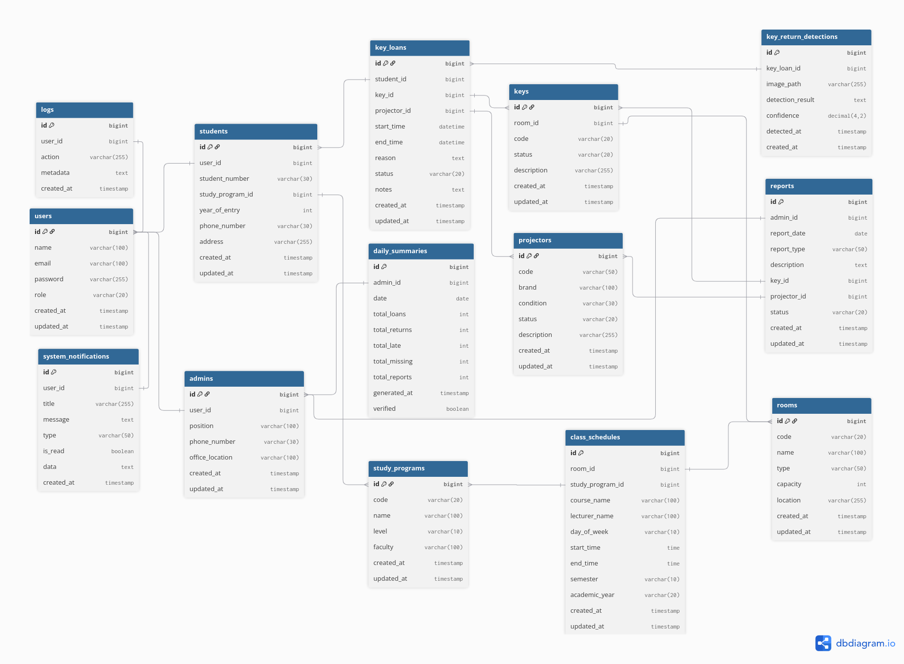
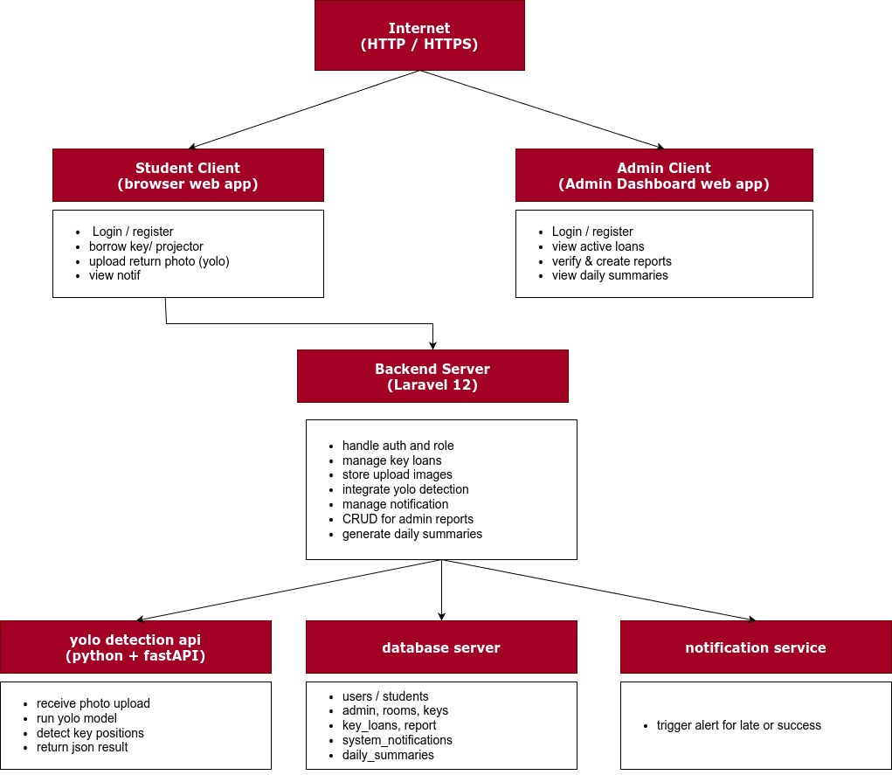
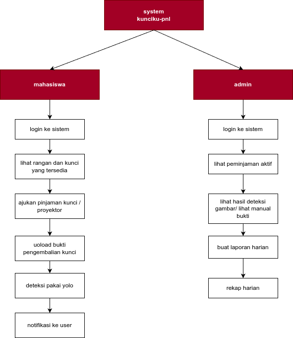

# KUNCIKU-PNL

##  **Anggota Kelompok**

| No  | Nama                | NIM           | Peran   |
| --- | ------------------- | ------------- | ------- |
| 1   | **Rausyanul Fikri** | 2024573010122 | Leader  |
| 2   | **Tri Akmal**       | 2024573010074 | Anggota |
| 3   | **Naiza Fitri**     | 2024573010104 | Anggota |
| 4   | **Zuhratul Fazla**  | 2024573010107 | Anggota |

---

---

## **Entity Relationship Diagram (ERD)**

### **Penjelasan ERD**
ERD menggambarkan struktur basis data pada sistem **Kunciku-PNL**, mencakup entitas utama seperti `users`, `students`, `admins`, `keys`, dan `key_loans`.

#### **Relasi Antar Entitas**
| Relasi                                | Tipe  | Deskripsi                                              |
| ------------------------------------- | ----- | ------------------------------------------------------ |
| `users` → `students`                  | 1 : 1 | Setiap mahasiswa memiliki satu akun user.              |
| `users` → `admins`                    | 1 : 1 | Setiap admin juga merupakan user dengan role khusus.   |
| `study_programs` → `students`         | 1 : N | Satu program studi memiliki banyak mahasiswa.          |
| `rooms` → `keys`                      | 1 : 1 | Setiap ruangan memiliki satu kunci unik.               |
| `keys` → `key_loans`                  | 1 : N | Satu kunci dapat dipinjam berkali-kali.                |
| `projectors` → `key_loans`            | 1 : N | Proyektor bersifat opsional saat peminjaman.           |
| `students` → `key_loans`              | 1 : N | Satu mahasiswa dapat memiliki banyak transaksi pinjam. |
| `key_loans` → `key_return_detections` | 1 : 1 | Tiap peminjaman memiliki satu hasil deteksi dari YOLO. |
| `admins` → `reports`                  | 1 : N | Admin membuat banyak laporan per hari.                 |
| `admins` → `daily_summaries`          | 1 : N | Admin memverifikasi rekap harian sistem.               |
| `users` → `system_notifications`      | 1 : N | User menerima banyak notifikasi.                       |
| `users` → `logs`                      | 1 : N | Mencatat aktivitas sistem dan user.                    |

---

## **Arsitektur Sistem**

###  **Penjelasan Arsitektur**
Sistem Kunciku-PNL dibangun menggunakan arsitektur Laravel Blade MVC (Model-View-Controller)** dengan integrasi YOLO AI Detection API.

#### **1. Presentation Layer (Frontend - Laravel Blade)**
- Antarmuka pengguna dibuat menggunakan **Blade Component** dan **TailwindCSS**.
- Terdapat dua jenis tampilan utama:
  - **Mahasiswa:** Login, melihat ruangan, mengajukan peminjaman, upload bukti pengembalian.
  - **Admin:** Login, melihat data peminjaman aktif, verifikasi hasil YOLO, membuat laporan, melihat rekap harian.
- Blade Components digunakan untuk menyusun UI seperti:
  - Layout utama (`layouts/app.blade.php`)
  - Komponen tabel, kartu informasi, form, dan notifikasi.

#### **2. Application Layer (Backend - Laravel)**
- Menggunakan **Laravel 12** sebagai framework utama.
- Mengatur seluruh logika sistem melalui controller:
  - `AuthController` — login & role.
  - `LoanController` — peminjaman & pengembalian kunci.
  - `DetectionController` — komunikasi dengan YOLO API.
  - `ReportController` — laporan harian admin.
  - `SummaryController` — rekap otomatis.
- Menggunakan **Eloquent ORM** untuk manajemen relasi antar tabel.

#### **3. AI Service (YOLO Detection API)**
- API eksternal berbasis **Python + FastAPI**.
- Menerima gambar dari sistem Laravel (via upload form mahasiswa).
- Jalankan model YOLO → hasil dikirim kembali ke Laravel sebagai JSON.

#### **4. Database Layer**
- Menggunakan **PostgreSQL**.
- Menyimpan seluruh data pengguna, ruangan, peminjaman, laporan, hasil deteksi, dan rekap harian.

#### **5. Notification System**
- Menggunakan event & queue Laravel.
- Mengirim notifikasi otomatis ke mahasiswa:
  - Peminjaman berhasil
  - Pengembalian terlambat
  - Hasil deteksi YOLO gagal/sukses

#### **6.  Cron Scheduler**
- Menjalankan rekap otomatis setiap malam.
- Mengisi tabel `daily_summaries` berdasarkan data `key_loans` dan `reports`.

---

##  **Use Case Diagram**

###  **Penjelasan Use Case**
Use Case Diagram menunjukkan interaksi antara pengguna dan sistem utama.

#### **Aktor Utama**
| Aktor               | Deskripsi                                                       |
| ------------------- | --------------------------------------------------------------- |
| Mahasiswa         | Pengguna yang meminjam kunci/proyektor dan mengembalikan kunci. |
| Admin             | Petugas fakultas yang mengelola peminjaman dan laporan.         |
| YOLO System       | Sistem AI yang mendeteksi posisi kunci berdasarkan foto.        |
| Sistem Notifikasi | Pengirim notifikasi otomatis ke mahasiswa.                      |

#### **Daftar Use Case**
| No  | Use Case                              | Aktor             | Deskripsi                                         |
| --- | ------------------------------------- | ----------------- | ------------------------------------------------- |
| 1   | Login ke sistem                       | Mahasiswa, Admin  | Autentikasi pengguna sebelum mengakses fitur.     |
| 2   | Melihat daftar ruangan & kunci        | Mahasiswa         | Menampilkan data ruangan dan kunci yang tersedia. |
| 3   | Mengajukan peminjaman kunci/proyektor | Mahasiswa         | Mengisi form peminjaman.                          |
| 4   | Upload bukti pengembalian             | Mahasiswa         | Mengunggah gambar pengembalian ke sistem.         |
| 5   | Deteksi YOLO otomatis                 | YOLO System       | Mendeteksi posisi kunci.                          |
| 6   | Kirim notifikasi otomatis             | Sistem Notifikasi | Mengirim pesan info ke mahasiswa.                 |
| 7   | Lihat peminjaman aktif                | Admin             | Monitoring status peminjaman.                     |
| 8   | Verifikasi hasil YOLO                 | Admin             | Mengecek hasil deteksi otomatis.                  |
| 9   | Buat laporan harian                   | Admin             | Mencatat kunci rusak/hilang.                      |
| 10  | Lihat rekap harian                    | Admin             | Melihat data rekap harian dari sistem.            |

#### **Hubungan Use Case**
- “Upload foto pengembalian” **include** “Proses Deteksi YOLO”.
- “Proses Deteksi YOLO” **extend** “Kirim Notifikasi ke User”.
- “Buat laporan harian” **extend** “Rekap harian”.

## **Teknologi yang Digunakan**
| Komponen          | Teknologi                    |
| ----------------- | ---------------------------- |
| Framework Backend | Laravel 12                   |
| Frontend          | Laravel Blade Component      |
| Database          | PostgreSQL                   |
| AI Service        | YOLO (Python + FastAPI)      |
| CSS Framework     | TailwindCSS / Bootstrap      |
| Notification      | Laravel Queue / Event        |

---

## **Alur Singkat Sistem**
1. Mahasiswa login → lihat kunci yang tersedia  
2. Mengajukan peminjaman kunci (opsional proyektor)  
3. Setelah digunakan, mahasiswa upload foto pengembalian  
4. istem kirim ke YOLO API → hasil dikirim ke backend  
5. Laravel update status & kirim notifikasi otomatis  
6. Admin melihat hasil deteksi dan membuat laporan  
7. Sistem buat rekap otomatis setiap malam  

---

